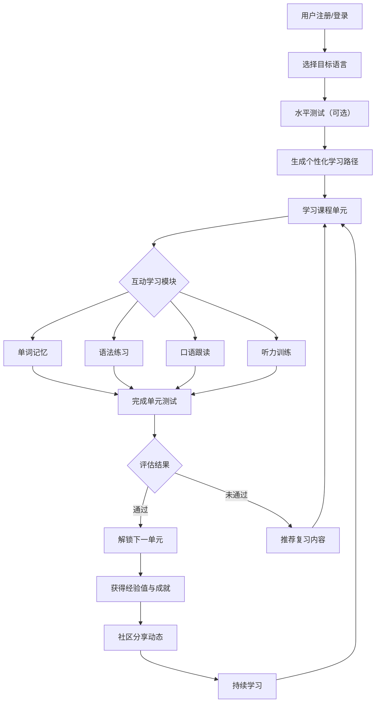

## 1. 产品概述

一款沉浸式多语种在线教育平台，提供英语、日语、韩语等主流语言的系统化学习服务。通过分级课程体系、互动式学习模块、个性化学习路径和社区激励系统，打造全方位语言学习体验。

- 解决传统语言学习缺乏沉浸感、个性化不足、枯燥无趣的问题
- 面向从零基础到高级进阶的全体语言学习者
- 目标成为兼具专业性与趣味性的下一代语言学习平台

## 2. 核心功能

### 2.1 用户角色

| 角色 | 注册方式 | 核心权限 |
|------|----------|----------|
| 普通用户 | 邮箱/手机号注册 | 浏览课程、参与学习、社区互动、查看进度 |
| VIP用户 | 付费升级 | 解锁全部高级课程、专属学习计划、AI口语评分 |
| 管理员 | 系统内置 | 内容管理、用户管理、数据分析 |

### 2.2 功能模块

1. **首页**：语种选择、热门课程推荐、学习统计概览、每日学习任务
2. **课程中心**：分级课程展示、课程筛选、课程详情、学习入口
3. **互动学习**：单词记忆（闪卡模式）、语法练习、口语跟读（录音+评分）、听力训练
4. **学习进度**：学习日历、掌握度统计、学习时长统计、技能雷达图
5. **个人中心**：用户资料、设置、学习记录、收藏课程、成就徽章
6. **社区广场**：学习动态、问答讨论、学习小组、打卡分享
7. **成就系统**：成就徽章墙、等级体系、排行榜、每日签到
8. **学习路径**：语言水平测试、个性化推荐、学习计划生成

### 2.3 页面详情

| 页面名称 | 模块名称 | 功能描述 |
|---------|---------|---------|
| 首页 | 语种选择器 | 展示英语/日语/韩语等语种，点击进入对应语言学习空间 |
| 首页 | 学习概览 | 显示当日学习进度、连续打卡天数、待复习词汇数 |
| 首页 | 每日推荐 | 基于学习记录推荐课程和学习内容 |
| 课程中心 | 分级课程 | 展示L1-L8各级课程卡片，含难度标签、课程封面 |
| 课程中心 | 筛选排序 | 按语种、难度、类型筛选课程 |
| 互动学习 | 闪卡记忆 | 单词卡片正反面切换，左右滑动标记"认识/不认识" |
| 互动学习 | 语法练习 | 选择题、填空题、改错题等交互式语法练习 |
| 互动学习 | 口语跟读 | 播放原声 → 用户录音 → AI评分 → 发音反馈 |
| 互动学习 | 听力训练 | 听音频选答案、听写填空、跟读模仿 |
| 学习进度 | 统计面板 | 学习时长曲线图、词汇量增长趋势、语法掌握度分布 |
| 学习进度 | 技能雷达 | 听说读写译五项技能雷达图展示 |
| 社区广场 | 动态流 | 用户学习打卡、成就分享的时间线 |
| 社区广场 | 问答区 | 语言学习问题发布与回答 |
| 成就系统 | 徽章墙 | 展示已获得和未获得的成就徽章 |
| 成就系统 | 排行榜 | 周榜/月榜/总榜，按学习积分排名 |
| 学习路径 | 水平测试 | 多语种分级测评，确定当前语言水平等级 |
| 学习路径 | 路径推荐 | 根据测评结果生成个性化学习路线图 |

## 3. 核心流程

用户从注册登录到完成学习任务的主流程：

## 4. 用户界面设计

### 4.1 设计风格

- **设计理念**："文化之旅"——每种语言代表一种文化，通过视觉元素营造沉浸氛围
- **主色调**：琥珀橙 (#E8953C) —— 温暖、活力、文化底蕴
- **辅色调**：深海蓝 (#1A3A5C) —— 沉稳、专业、值得信赖
- **强调色**：樱花粉 (#F2A7B3，日语区)、枫叶红 (#C23B22，英语区)、青瓷绿 (#5B9E6B，韩语区)
- **字体**：标题使用"Noto Serif SC"（衬线体，文化感）+ 正文使用"Noto Sans SC"（无衬线体，清晰易读）
- **按钮样式**：圆角略大 (12px)，实心主色按钮 + 浅色描边次要按钮，微悬停上浮效果
- **布局风格**：卡片式布局，大圆角 (16px)，柔和阴影，留白充分
- **图标风格**：线性图标为主，辅以 Emoji 作为情感点缀
- **动效风格**：平滑过渡，页面切换渐变，卡片加载错落动画，微交互反馈

### 4.2 页面设计概览

| 页面名称 | 模块名称 | UI元素 |
|---------|---------|--------|
| 首页 | 语种选择器 | 大尺寸圆形图标+语种名称，悬停放大动效，选择后渐变过渡到语种首页 |
| 首页 | 学习概览 | 顶部用户欢迎语+连续打卡徽章，中部环形进度图，底部快捷入口 |
| 课程中心 | 课程卡片 | 带语种特色边框的卡片（英式格纹/日式和柄/韩式几何），难度星级，课程封面插画 |
| 互动学习 | 闪卡记忆 | 全屏卡片，正反面翻转3D动画，底部"认识/不认识"按钮带手势滑动 |
| 互动学习 | 口语跟读 | 波形音频可视化，录音按钮脉冲动画，评分结果五星展示 |
| 学习进度 | 统计面板 | 折线图/柱状图展示学习数据，时间范围选择器 |
| 社区广场 | 动态流 | 瀑布流卡片布局，支持图片/文字/成就分享 |
| 成就系统 | 徽章墙 | 网格排列徽章，未获得徽章灰色锁定状态，获得后发光动效 |

### 4.3 响应式设计

- 桌面优先设计，最低支持 1024px 宽度
- 平板端 (768-1024px) 自适应网格布局调整
- 移动端 (<768px) 单列布局，底部导航栏
- 交互组件支持触控操作（滑动手势、长按等）

## 5. 非功能需求

- 页面加载时间不超过 2 秒
- 支持离线学习模式（已下载课程）
- 音频播放延迟不超过 500ms
- 支持 PWA 安装到桌面
