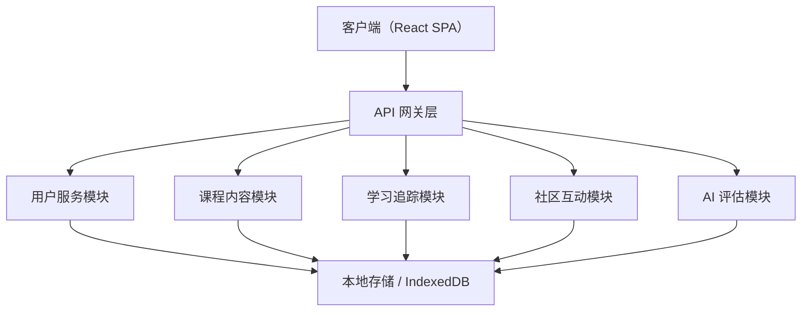
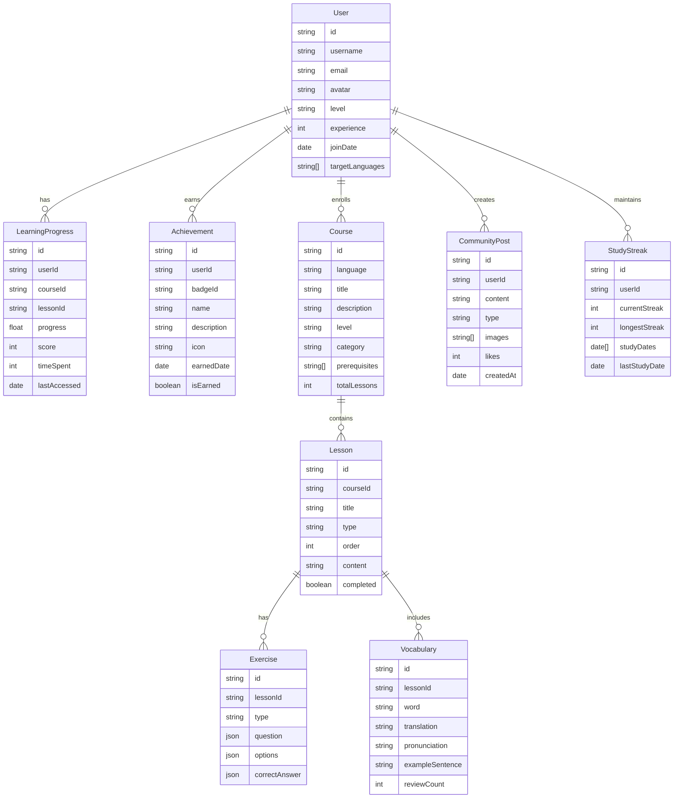

## 1. 架构设计



## 2. 技术选型

| 层级 | 技术 | 说明 |
|------|------|------|
| 前端框架 | React 18 + TypeScript | 组件化开发，类型安全 |
| 构建工具 | Vite | 快速启动和热更新 |
| 样式方案 | TailwindCSS 3 | 高效样式开发 |
| 路由方案 | React Router 6 | SPA 路由管理 |
| 状态管理 | Zustand | 轻量级状态管理 |
| 数据可视化 | Chart.js + react-chartjs-2 | 学习统计数据展示 |
| 音频处理 | Web Audio API | 口语跟读录音与播放 |
| 动画库 | Framer Motion | 页面过渡和交互动画 |
| 图标库 | Lucide React | 统一线性图标风格 |
| 数据持久化 | IndexedDB (idb库) | 离线存储学习数据 |

## 3. 路由定义

| 路由 | 页面 | 说明 |
|------|------|------|
| / | 首页 | 语种选择 + 学习概览 |
| /login | 登录页 | 邮箱/手机号登录 |
| /register | 注册页 | 新用户注册 |
| /courses | 课程中心 | 分级课程展示 |
| /courses/:lang | 语种课程 | 特定语言课程列表 |
| /learn/:courseId | 互动学习 | 学习单元主界面 |
| /learn/:courseId/vocab | 单词记忆 | 闪卡学习模块 |
| /learn/:courseId/grammar | 语法练习 | 语法交互练习 |
| /learn/:courseId/speaking | 口语跟读 | 口语训练模块 |
| /learn/:courseId/listening | 听力训练 | 听力练习模块 |
| /progress | 学习进度 | 学习统计面板 |
| /community | 社区广场 | 用户动态与问答 |
| /achievements | 成就系统 | 徽章与排行榜 |
| /profile | 个人中心 | 用户信息与设置 |
| /path | 学习路径 | 水平测试与路径推荐 |

## 4. 数据模型

### 4.1 数据模型定义



### 4.2 本地存储数据结构

```typescript
// 用户数据
interface User {
  id: string;
  username: string;
  email: string;
  avatar: string;
  level: string;
  experience: number;
  joinDate: string;
  targetLanguages: string[];
}

// 课程数据
interface Course {
  id: string;
  language: string;
  title: string;
  description: string;
  level: string;
  category: 'vocabulary' | 'grammar' | 'speaking' | 'listening' | 'comprehensive';
  prerequisites: string[];
  totalLessons: number;
  coverColor: string;
  icon: string;
}

// 课程单元
interface Lesson {
  id: string;
  courseId: string;
  title: string;
  type: 'vocabulary' | 'grammar' | 'speaking' | 'listening' | 'quiz';
  order: number;
  content: LessonContent;
  xpReward: number;
}

// 学习进度
interface LearningProgress {
  userId: string;
  courseId: string;
  lessonId: string;
  progress: number; // 0-100
  score: number; // 0-100
  timeSpent: number; // 秒
  lastAccessed: string;
  completed: boolean;
}

// 词汇卡片
interface VocabularyWord {
  id: string;
  word: string;
  translation: string;
  pronunciation: string;
  audioUrl?: string;
  exampleSentence: string;
  exampleTranslation: string;
  partOfSpeech: string;
  difficulty: 1 | 2 | 3 | 4 | 5;
  masteryLevel: number; // 0-5
  reviewCount: number;
}

// 成就徽章
interface Achievement {
  id: string;
  name: string;
  description: string;
  icon: string;
  condition: AchievementCondition;
  isEarned: boolean;
  earnedDate?: string;
}

// 学习路径推荐
interface LearningPath {
  userId: string;
  language: string;
  currentLevel: string;
  recommendedCourses: string[];
  weeklyGoal: number;
  focusAreas: string[];
  estimatedDuration: string;
}
```

## 5. 组件架构

```
src/
├── components/           # 通用组件
│   ├── ui/              # 基础 UI 组件（Button, Card, Modal 等）
│   ├── layout/          # 布局组件（Header, Sidebar, Footer）
│   └── shared/          # 共享业务组件（CourseCard, ProgressRing 等）
├── pages/               # 页面组件
│   ├── Home/
│   ├── Login/
│   ├── Courses/
│   ├── Learn/
│   ├── Progress/
│   ├── Community/
│   ├── Achievements/
│   └── Profile/
├── stores/              # Zustand 状态管理
│   ├── userStore.ts
│   ├── courseStore.ts
│   ├── progressStore.ts
│   └── communityStore.ts
├── hooks/               # 自定义 Hooks
├── utils/               # 工具函数
├── data/                # 模拟数据
├── types/               # TypeScript 类型定义
└── assets/              # 静态资源
```
